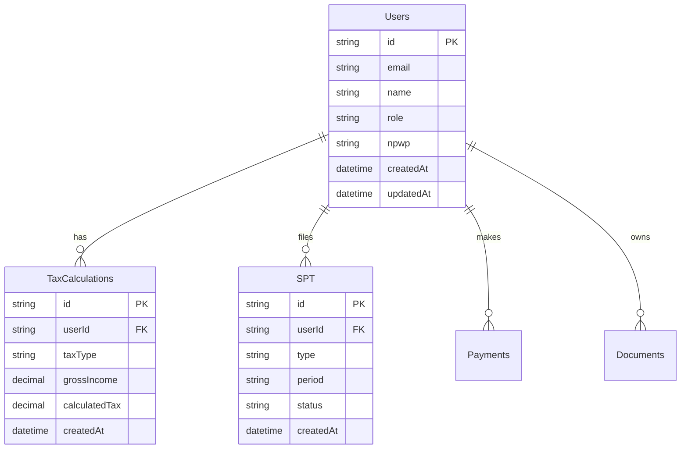

# 🏛️ CoreTax - Sistem Manajemen Pajak Indonesia

<div align="center">

**Sistem Manajemen Pajak Modern yang Efisien dan Mudah Digunakan**

[](LICENSE)
[](https://www.typescriptlang.org/)
[](https://nextjs.org/)
[](https://tailwindcss.com/)
[](https://web.dev/progressive-web-apps/)
[](https://github.com/yourusername/coretax)

[📖 Dokumentasi](docs/) • [🚀 Demo Live](https://coretax-demo.vercel.app) • [🐛 Laporkan Bug](https://github.com/yourusername/coretax/issues) • [💬 Diskusi](https://github.com/yourusername/coretax/discussions)

</div>

---

## 📋 Table of Contents

- [🌟 Fitur Utama](#-fitur-utama)
- [🎯 Target Pengguna](#-target-pengguna)
- [🚀 Quick Start](#-quick-start)
- [📦 Teknologi Stack](#-teknologi-stack)
- [🏗️ Arsitektur Sistem](#-arsitektur-sistem)
- [📱 Progressive Web App](#-progressive-web-app)
- [🛠️ Development](#-development)
- [📊 Dashboard Preview](#-dashboard-preview)
- [🤝 Kontribusi](#-kontribusi)
- [📄 License](#-license)
- [🙏 Acknowledgments](#-acknowledgments)

---

## 🌟 Fitur Utama

### 💼 Manajemen Pajak Lengkap
- **SPT Management**: Kelola Surat Pemberitahuan Tahunan/Masaan
- **Tax Calculator**: Kalkulator pajak otomatis untuk berbagai jenis pajak
- **Payment Integration**: Integrasi pembayaran pajak online
- **Document Management**: Upload dan kelola dokumen perpajakan

### 📊 Dashboard Analitik
- **Real-time Statistics**: Statistik pajak real-time
- **Tax Overview**: Ringkasan pembayaran dan kewajiban pajak
- **Financial Reports**: Laporan keuangan perpajakan
- **Tax Calendar**: Kalender jatuh tempo pembayaran pajak

### 🔐 Keamanan & Autentikasi
- **User Authentication**: Sistem login yang aman
- **Role-based Access**: Kontrol akses berdasarkan peran (Admin, Wajib Pajak, Konsultan)
- **Data Encryption**: Enkripsi data sensitif
- **Audit Trail**: Log aktivitas pengguna

### 📱 Progressive Web App
- **Offline Support**: Aplikasi dapat digunakan tanpa internet
- **Installable**: Dapat diinstall sebagai aplikasi native
- **Push Notifications**: Notifikasi jatuh tempo dan pengingat
- **Responsive Design**: Optimal di desktop dan mobile

---

## 🎯 Target Pengguna

- 🏢 **Perusahaan**: UMKM hingga korporasi besar
- 👤 **Wajib Pajak**: Individu dengan kewajiban perpajakan
- 🧑‍💼 **Konsultan Pajak**: Profesional perpajakan
- 🏛️ **Instansi Pemerintah**: Untuk monitoring dan administrasi

---

## 🚀 Quick Start

### Prerequisites

- Node.js 18+ 
- npm atau yarn
- Database (SQLite untuk development, PostgreSQL untuk production)

### Installation

```bash
# Clone repository
git clone https://github.com/yourusername/coretax.git
cd coretax

# Install dependencies
npm install

# Setup database
npm run db:push

# Start development server
npm run dev
```

Aplikasi akan berjalan di [http://localhost:3000](http://localhost:3000)

### Environment Variables

```bash
# Copy .env.example ke .env.local
cp .env.example .env.local

# Edit .env.local dengan konfigurasi Anda
NEXTAUTH_URL=http://localhost:3000
NEXTAUTH_SECRET=your-secret-key
DATABASE_URL="file:./dev.db"
```

---

## 📦 Teknologi Stack

### Frontend
- **[Next.js 15](https://nextjs.org/)** - React framework dengan App Router
- **[TypeScript](https://www.typescriptlang.org/)** - Type safety dan better developer experience
- **[Tailwind CSS](https://tailwindcss.com/)** - Utility-first CSS framework
- **[shadcn/ui](https://ui.shadcn.com/)** - Modern React component library
- **[Lucide React](https://lucide.dev/)** - Beautiful icons
- **[Framer Motion](https://www.framer.com/motion/)** - Smooth animations

### Backend
- **[NextAuth.js](https://next-auth.js.org/)** - Authentication framework
- **[Prisma](https://www.prisma.io/)** - Modern database toolkit
- **[SQLite](https://www.sqlite.org/)** - Database untuk development
- **[Zod](https://zod.dev/)** - Schema validation

### DevOps & Tools
- **[ESLint](https://eslint.org/)** - Code linting
- **[Prettier](https://prettier.io/)** - Code formatting
- **[Husky](https://typicode.github.io/husky/)** - Git hooks
- **[Commitlint](https://commitlint.js.org/)** - Commit message linting

---

## 🏗️ Arsitektur Sistem

```
CoreTax/
├── src/
│   ├── app/                    # Next.js App Router
│   │   ├── (auth)/           # Auth routes
│   │   ├── api/              # API routes
│   │   ├── dashboard/       # Dashboard pages
│   │   └── globals.css       # Global styles
│   ├── components/           # Reusable components
│   │   ├── ui/              # shadcn/ui components
│   │   ├── forms/           # Form components
│   │   └── charts/          # Chart components
│   ├── lib/                 # Utility libraries
│   │   ├── auth.ts          # Authentication config
│   │   ├── db.ts            # Database client
│   │   └── utils.ts         # Utility functions
│   └── types/               # TypeScript definitions
├── prisma/                  # Database schema
├── public/                  # Static assets
└── docs/                    # Documentation
```

### Database Schema



---

## 📱 Progressive Web App

CoreTax adalah PWA yang dapat diinstall di berbagai platform:

### Installation
1. Buka [CoreTax](https://coretax-demo.vercel.app) di browser
2. Klik tombol "Install" di address bar
3. Atau dari menu browser → "Add to Home Screen"

### PWA Features
- ✅ **Offline Functionality**: Akses data tanpa internet
- ✅ **Background Sync**: Sinkronisasi data otomatis
- ✅ **Push Notifications**: Pengingat jatuh tempo pajak
- ✅ **App-like Experience**: Full screen, standalone mode
- ✅ **Cross-platform**: Windows, macOS, Linux, Android, iOS

---

## 🛠️ Development

### Available Scripts

```bash
# Development
npm run dev          # Start development server
npm run build        # Build for production
npm run start        # Start production server
npm run lint         # Run ESLint

# Database
npm run db:push      # Push schema to database
npm run db:studio    # Open Prisma Studio
npm run db:seed      # Seed database with sample data

# Code Quality
npm run format       # Format code with Prettier
npm run type-check   # Run TypeScript type checking
```

### Project Structure

```
src/
├── app/                    # Next.js App Router
│   ├── api/               # API Routes
│   │   ├── auth/          # Authentication endpoints
│   │   ├── dashboard/     # Dashboard data
│   │   └── tax/          # Tax-related endpoints
│   ├── (auth)/           # Auth group
│   │   ├── login/        # Login page
│   │   └── register/     # Register page
│   ├── dashboard/        # Dashboard pages
│   │   ├── page.tsx      # Main dashboard
│   │   ├── spt/          # SPT management
│   │   └── analytics/    # Analytics page
│   └── globals.css       # Global styles
├── components/           # React components
│   ├── ui/              # shadcn/ui components
│   ├── forms/           # Form components
│   ├── charts/          # Chart components
│   └── layout/          # Layout components
├── lib/                 # Utility libraries
│   ├── auth.ts          # NextAuth configuration
│   ├── db.ts            # Prisma client
│   ├── utils.ts         # Utility functions
│   └── validations.ts   # Zod schemas
└── types/               # TypeScript definitions
```

---

## 📊 Dashboard Preview

### Main Dashboard


### Tax Calculator


### SPT Management


### Mobile View


---

## 🤝 Kontribusi

Kami sangat welcome kontribusi dari komunitas! Silakan baca [CONTRIBUTING.md](CONTRIBUTING.md) untuk detail panduan kontribusi.

### Cara Kontribusi

1. **Fork** repository
2. **Clone** fork Anda: `git clone https://github.com/yourusername/coretax.git`
3. **Create** branch baru: `git checkout -b feature/amazing-feature`
4. **Commit** perubahan: `git commit -m 'Add amazing feature'`
5. **Push** ke branch: `git push origin feature/amazing-feature`
6. **Open** Pull Request

### Development Guidelines

- Ikuti [conventional commits](https://www.conventionalcommits.org/)
- Gunakan TypeScript untuk type safety
- Ikuti ESLint dan Prettier configuration
- Tulis test untuk fitur baru
- Update dokumentasi

---

## 📄 License

Distributed under the MIT License. See [LICENSE](LICENSE) for more information.

---

## 🙏 Acknowledgments

- **[Next.js Team](https://nextjs.org/)** - Amazing React framework
- **[shadcn/ui](https://ui.shadcn.com/)** - Beautiful component library
- **[Tailwind CSS](https://tailwindcss.com/)** - Utility-first CSS framework
- **[Prisma](https://www.prisma.io/)** - Modern database toolkit
- **[Indonesian Tax Community](https://www.pajak.go.id/)** - Inspiration and domain knowledge

---

<div align="center">

**Made with ❤️ by CoreTax Team**

[](https://coretax.id)
[](https://twitter.com/coretax)
[](https://linkedin.com/company/coretax)

⭐ **Star this repository** jika Anda menyukai proyek ini!

</div>
