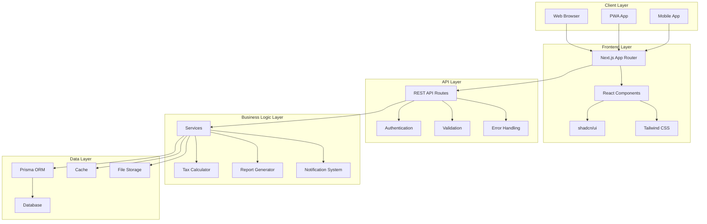

# 🏗️ System Architecture

## Overview

CoreTax adalah sistem manajemen pajak modern yang dibangun dengan arsitektur full-stack menggunakan Next.js 15 dengan App Router. Sistem ini dirancang untuk scalable, maintainable, dan user-friendly.

## High-Level Architecture



## Technology Stack

### Frontend
- **Next.js 15**: React framework dengan App Router
- **TypeScript**: Type safety dan better developer experience
- **Tailwind CSS**: Utility-first CSS framework
- **shadcn/ui**: Modern React component library
- **Lucide React**: Beautiful icons
- **Framer Motion**: Smooth animations

### Backend
- **NextAuth.js**: Authentication framework
- **Prisma**: Modern database toolkit
- **SQLite/PostgreSQL**: Database
- **Zod**: Schema validation
- **Jest**: Testing framework

### DevOps
- **ESLint**: Code linting
- **Prettier**: Code formatting
- **Husky**: Git hooks
- **GitHub Actions**: CI/CD

## Project Structure

```
coretax/
├── src/
│   ├── app/                    # Next.js App Router
│   │   ├── api/               # API Routes
│   │   │   ├── auth/          # Authentication endpoints
│   │   │   ├── dashboard/     # Dashboard data
│   │   │   ├── tax/          # Tax-related endpoints
│   │   │   └── documents/    # Document management
│   │   ├── (auth)/           # Auth group
│   │   │   ├── login/        # Login page
│   │   │   └── register/     # Register page
│   │   ├── dashboard/        # Dashboard pages
│   │   │   ├── page.tsx      # Main dashboard
│   │   │   ├── spt/          # SPT management
│   │   │   ├── calculator/   # Tax calculator
│   │   │   └── analytics/    # Analytics page
│   │   ├── globals.css       # Global styles
│   │   ├── layout.tsx        # Root layout
│   │   └── page.tsx          # Home page
│   ├── components/           # React components
│   │   ├── ui/              # shadcn/ui components
│   │   ├── forms/           # Form components
│   │   ├── charts/          # Chart components
│   │   └── layout/          # Layout components
│   ├── lib/                 # Utilities and configs
│   │   ├── auth.ts          # NextAuth configuration
│   │   ├── db.ts            # Prisma client
│   │   ├── utils.ts         # Helper functions
│   │   └── validations.ts   # Zod schemas
│   ├── types/               # TypeScript definitions
│   └── hooks/               # Custom React hooks
├── prisma/                  # Database schema
├── public/                  # Static assets
├── docs/                    # Documentation
└── tests/                   # Test files
```

## Security Architecture

### Authentication & Authorization
- **JWT Tokens**: Stateless authentication
- **Role-based Access**: Admin, Wajib Pajak, Konsultan
- **Session Management**: Secure session handling
- **Password Hashing**: bcrypt for password security

### Data Security
- **Encryption**: Sensitive data encryption
- **Input Validation**: Zod schema validation
- **SQL Injection Prevention**: Prisma ORM
- **XSS Prevention**: React's built-in protections

## Performance Architecture

### Caching Strategy
- **Database Caching**: Prisma query cache
- **API Caching**: Response caching
- **Client Caching**: Browser cache headers
- **CDN**: Static assets distribution

### Database Optimization
- **Indexing**: Proper database indexes
- **Query Optimization**: Efficient queries
- **Connection Pooling**: Database connection management

## Scalability Architecture

### Horizontal Scaling
- **Stateless Design**: Easy horizontal scaling
- **Load Balancing**: Multiple server instances
- **Database Sharding**: Data distribution
- **Microservices**: Service separation

### Monitoring & Logging
- **Error Tracking**: Comprehensive error monitoring
- **Performance Monitoring**: Application performance
- **User Analytics**: User behavior tracking
- **System Health**: Infrastructure monitoring

---

This architecture documentation provides a comprehensive overview of CoreTax's system design, technology stack, and implementation details. For more specific information, please refer to the respective documentation sections.